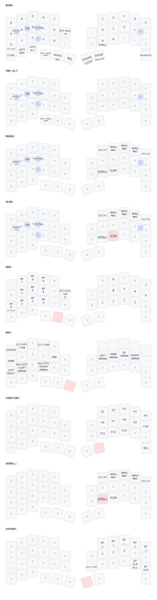

# zmk-config-roBa



`iwashita-nozomu/zmk-config-roBa` の個人用配置です。
配置の正本は [config/roBa.keymap](config/roBa.keymap) です。
[追跡Issue #226](https://github.com/iwashita-nozomu/project_template/issues/226) に
変更理由・検証結果・未解決事項を記録します。ファームウェアを実機へ書き込むまでは、
この配置が実機で有効になったとは限りません。ZMK Studioで保存した設定がある場合も
ビルド時のkeymapと異なる可能性があるため、書き込み後に実際の割り当てを確認してください。

## 基本操作

位置名は通常レイヤーの文字、位置番号は0始まりです。

| 位置 | 通常 | レイヤー保持中 |
| --- | --- | --- |
| 右親指内側、旧Backspace (40) | Esc | Escを維持 |
| 右下、旧Delete (42) | Backspace | FUNCTION中だけDelete。NAV/NUM中はBackspace |
| Enter (41) | タップでEnter | ホールド中はFUNCTION |
| 無変換 (39) | タップで無変換 | ホールド中はNAV |
| Space (38) | タップでSpace | ホールド中はNUM |
| 変換 (37) | タップで変換 | ホールド中はSYSTEM |
| H左隣の `-` (16) | タップで `-` | ホールド中はSCROLL |

上記の入口はlayer-tapなのでタップ／ホールドの判定があります。
MOUSE/NAV/FUNCTIONの位置16だけは、押した瞬間からSCROLLに入るmomentaryです。
いずれも保持を離すと対象レイヤーだけを解除し、他の有効レイヤーをリセットしません。
解除後の新規押下は、その時点の有効レイヤーで解決します。すでに押したキーを、
途中から別のHIDキーへ変換するという意味ではありません。

Backspace/Deleteの追加コンボはありません。Ctrl・GUI (Win/Command)・Altの専用キー、
Z/ShiftとNUMの0/Shiftは従来のままです。H/Iは通常の文字キーです。

## NAV

右手ホーム段のH/J/K/Lを、左/下/上/右にします。
旧E/S/D/Fの矢印割り当ては外しました。左側のHome/End、Ctrl+Tab、
Ctrl+Shift+Tab、GUI+Shift+左右矢印、エンコーダーのCtrl+PageUp/PageDownは維持します。
NAVのY/U/I/O/Pは明示的な文字入力で、自動MOUSEが残っていてもコピー／クリックに化けません。

## MOUSE / SCROLL

| 位置 | MOUSEとSCROLLで共通の出力 |
| --- | --- |
| Y | Ctrl+C |
| U | 左クリック (MB1) |
| I | 中クリック (MB3) |
| O | 右クリック (MB2) |
| P | Ctrl+V |

MOUSE中はH左隣を保持してトラックボールを動かすとスクロールします。
通常時は同じ位置のホールドで入れます。HJKLとは位置が重なりません。
SCROLLにも同じ上段bindingsを展開するため、MOUSEがタイムアウトした後や、
通常レイヤーから直接SCROLLへ入った場合も、UIOが文字へ落ちません。
押しっぱなしのクリックはボタン保持として使います。

SCROLL中はY/U/I/O/Pの操作をFUNCTIONなどより優先します。
SCROLLを離すと、残っているFUNCTION/NAV/NUM/MOUSEなどへ戻ります。
SYSTEM中は管理操作が最優先で、位置16は通常の `-` です。

## FUNCTION

```text
通常の位置:  Y    U    I    O    P
FUNCTION:   F1   F2   F3   F4   F5

通常の位置:  H    J    K    L    '
FUNCTION:   F6   F7   F8   F9  F10

通常の位置:  N    M    ,    .    /
FUNCTION:  F11  F12  F13   透過  透過

右下 (42): Delete
```

F11は旧 `/` からN、F12は旧右下からM、F13は旧H左隣から `,` へ移しました。
H左隣はFUNCTION中もmomentary SCROLLです。

## 優先順位と既存操作の移設

レイヤー番号の大きい方を優先します。

```text
BASE(0) < MOUSE(1) < NUM(2) < NAV(3) < FUNCTION(4) < SCROLL(5) < SYSTEM(6)
```

自動MOUSEより手動のNUM/NAV/FUNCTIONを優先します。
同時にNAVとFUNCTIONを保持したときはFUNCTIONのFキーが優先します。
SCROLLはポインティング操作の最上位、SYSTEMは管理用の最上位です。
番号はkeymap冒頭の定義・レイヤー順・trackball設定で揃えています。

NUMの右下にあった `|` はN左隣のキー (28、通常は `;`) へ移しました。
SYSTEMの右下にあった `BT_CLR_ALL` は `.` (32) へ移しました。
SYSTEMの `/` (33) の `BT_CLR` とY〜Pのプロファイル選択は維持します。
**SYSTEM + `.` は全Bluetoothペアリング情報を消去する操作です。**
右下は管理層でも通常はBackspaceで、FUNCTIONを同時に保持した場合だけDeleteです。

既存コンボ（S+D=Tab、D+F=Shift+Tab、A+S=無変換、L+`'`=`"`、C+V=`=`）は
BASE/MOUSEに限ります。コンボのlayers判定は最上位有効レイヤーを用いるため、
NAV/FUNCTION/NUM/SCROLL/SYSTEMでは発動しません。矢印やFキーを奪う旧グローバル設定は撤去しました。
変換／無変換のタップやコンボに結合していた `&to 0` も撤去しています。

## 未確定のIME / OS対応

「IMEを1つの物理キーのタップで切替」は希望仕様ですが、この変更では未実装です。
Windows/macOSの共通トグル送信方式が未確定のため、既存の変換／無変換キーコードを
維持しています。LANG1/LANG2の交互送信によるホスト状態の推測はしません。
MOUSEのY/Pは指定どおりCtrl+C/Vで、macOS向けのCommand+C/Vへの自動切替ではありません。
IMEトグルとCtrl/Command差の吸収、修飾キー再配置は別の設計事項です。

## 検証と描画

構造回帰検査はPython 3とCプリプロセッサ `cpp` で実行します。

```sh
python3 -m unittest discover -s tests -v
```

keymap内のマクロだけを展開し、43bindings、位置、優先順位、全64通りのレイヤー集合での
新規押下の参照先、コンボ対象範囲を検査します。
**ZMKヘッダはこの構造検査では読みません。ファームウェアのコンパイル、Devicetree binding検証、
hold-tapの時間判定、HIDイベント、実機動作を検証するテストではありません。**

正規ファームウェアビルドは既存の [.github/workflows/build.yml](.github/workflows/build.yml)、
図の生成は既存の [.github/workflows/draw.yml](.github/workflows/draw.yml) の
`Draw Keymap` workflowです。keymap・配置JSON・描画設定・描画workflowの変更をpushすると、
同じブランチに `keymap-drawer/roBa.{yaml,svg}` を生成・コミットします。
対象ブランチを指定した手動実行も可能です。入力は `config/roBa.keymap` と
`config/roBa.json` で、図を手編集する別経路は追加していません。
生成図を更新したコミット自身はpush対象の入力パスを変更しないため、描画を再帰起動しません。
現在の検証成否・実行阻害要因はIssue/PRに記録します。
